# 📊 Análise Detalhada - Superstore Sales Analysis

Este documento apresenta uma visão aprofundada das análises realizadas por dimensão no dataset Superstore.

---

## 📚 Sumário

- [🔸 Categoria](#categoria)
- [🔸 Subcategoria](#subcategoria)
- [🔸 Região](#região)
- [🔸 Segmento](#segmento)
- [🔸 Cliente - Top 20](#cliente---top-20)
- [🔸 Análise de Correlação](#análise-de-correlação)
- [📈 Resultados e Insights](#📈-resultados-e-insights)
- [🧠 Conclusões e Recomendações](#🧠-conclusões-e-recomendações)

---

# 🔹 Categoria

## 📊 Total de Vendas por Categoria

### 🔍 O que foi feito

Foi criado um gráfico de barras para apresentar o **total de vendas (em valor monetário)** de uma loja fictícia, segmentado por categoria de produtos. Os dados foram agrupados pela variável:

- `Category`: categoria do produto (`Furniture`, `Office Supplies`, `Technology`)
- `Sales`: valor monetário das vendas

A soma total por categoria foi calculada e visualizada com `seaborn.barplot()`.

### 📈 Principais Insights

1. **Categoria com maior faturamento: Technology**
   - A categoria **Technology** lidera as vendas, com um total superior a **$840.000**, indicando alto valor agregado por item ou forte volume de vendas.

2. **Furniture e Office Supplies em patamares similares**
   - Ambas as categorias apresentam vendas totais entre **$720.000 e $750.000**, com Furniture levemente à frente.
   - Isso sugere um **desempenho equilibrado** entre os segmentos, mas com potencial de crescimento em estratégias distintas.

3. **Tecnologia como motor de receita**
   - O domínio da categoria Technology pode indicar:
     - Alta demanda por eletrônicos e acessórios
     - Maiores margens por item
     - Campanhas promocionais eficazes nesse segmento

### 🧠 Conclusões Gerais

- A análise por categoria fornece **visão estratégica da composição da receita**, útil para ações de marketing, reposição de estoque e foco em atendimento especializado.
- Sugere-se acompanhar essa análise com:
  - **Lucro por categoria** (e não apenas vendas)
  - **Ticket médio**
  - **Frequência de compra por segmento**

## 📊 Quantidade Total de Produtos Vendidos por Categoria

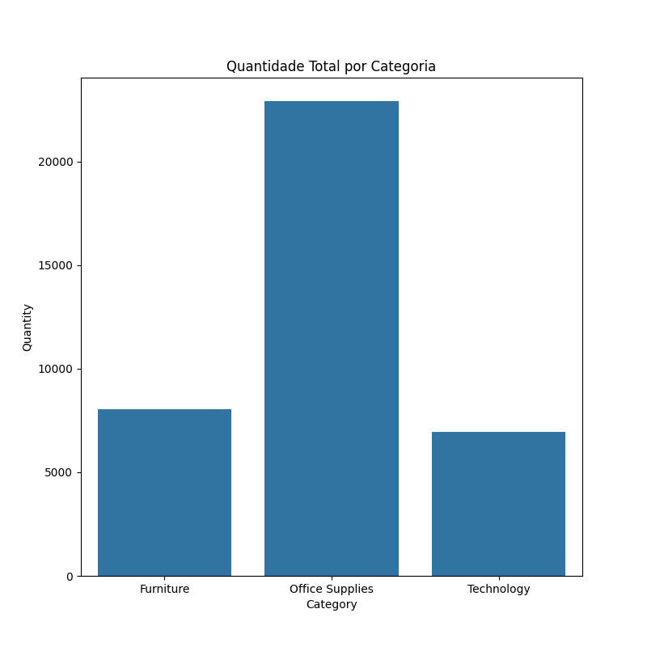

### 🔍 O que foi feito

Foi criado um gráfico de barras exibindo o **volume total de unidades vendidas** por categoria de produto. As variáveis utilizadas foram:

- `Category`: categoria de produtos (`Furniture`, `Office Supplies`, `Technology`)
- `Quantity`: número total de unidades vendidas

Os dados foram agrupados por categoria e somados.

### 📈 Principais Insights

1. **Office Supplies lidera em quantidade**
   - A categoria **Office Supplies** ultrapassa 23.000 unidades vendidas, o que representa **o maior volume de vendas em quantidade**, embora não necessariamente em valor.

2. **Furniture e Technology com menor volume**
   - Ambas as categorias venderam significativamente menos em quantidade:
     - **Furniture:** cerca de 8.000 unidades
     - **Technology:** cerca de 7.000 unidades

3. **Venda em grande escala de itens de baixo valor**
   - O alto volume em `Office Supplies` indica que os produtos têm **alto giro**, mas provavelmente **baixo ticket médio** (papel, canetas, clipes, etc.).

4. **Tecnologia: menos itens, maior valor**
   - Em contraste, `Technology` vende menos unidades, mas sabemos (pelo gráfico anterior) que gera **maior valor em vendas**, confirmando seu **alto valor unitário**.

### 🧠 Conclusões Gerais

- A análise de quantidade por categoria é essencial para entender o **perfil operacional da loja**, especialmente para:
  - **Gestão de estoque**
  - **Logística**
  - **Planejamento de compras e reposições**
- Combinar essas informações com dados de lucro e margem ajuda a identificar **categorias estratégicas por valor e volume**.

## 📊 Lucro por Categoria

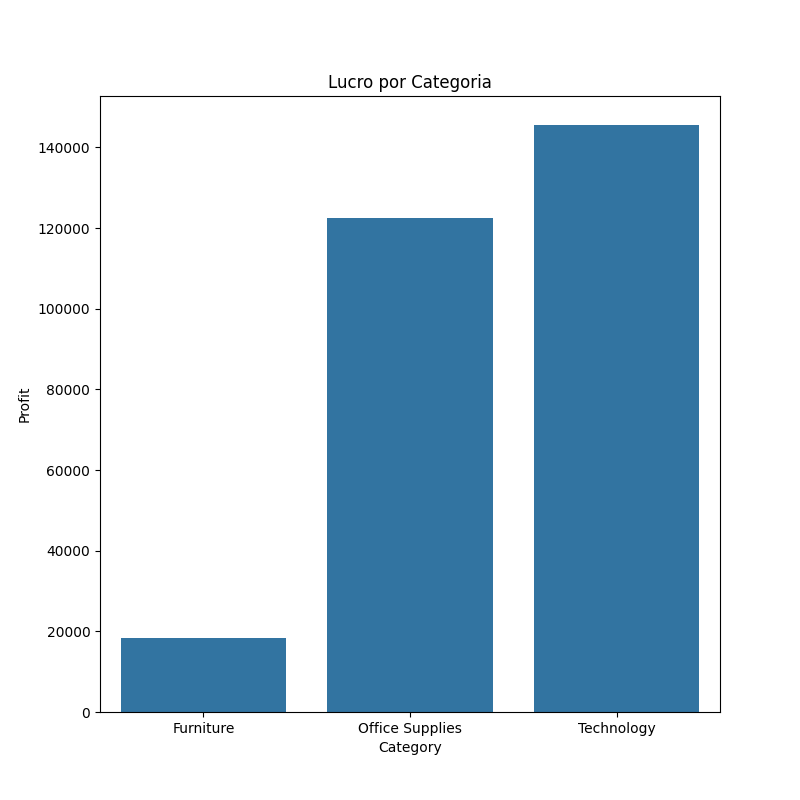

### 🔍 O que foi feito

Foi gerado um gráfico de barras exibindo o **lucro total obtido por categoria de produto**, com base nos dados históricos de vendas.

As variáveis analisadas foram:

- `Category`: categoria do produto (`Furniture`, `Office Supplies`, `Technology`)
- `Profit`: lucro gerado (vendas menos custo)

Os valores foram agregados via `groupby` e somados por categoria.

### 📈 Principais Insights

1. **Technology: maior lucratividade**
   - A categoria **Technology** apresentou o maior lucro absoluto, superior a **$145.000**, confirmando seu alto valor agregado e margem por unidade.

2. **Office Supplies: equilíbrio entre volume e margem**
   - Com cerca de **$123.000 de lucro**, Office Supplies demonstra ser uma **categoria rentável**, mesmo com preços unitários mais baixos, graças ao **alto volume de vendas**.

3. **Furniture: baixa margem de contribuição**
   - Apesar de ter vendas relevantes, Furniture obteve o menor lucro (cerca de **$19.000**), possivelmente devido a:
     - Altos custos logísticos
     - Descontos excessivos
     - Margem unitária reduzida

### 🧠 Conclusões Gerais

- O lucro por categoria é fundamental para avaliar a **eficiência comercial**, indo além do volume de vendas.
- A análise revela que **vender muito nem sempre significa lucrar mais** — o foco deve estar em categorias com **boa margem e volume estratégico**.
- Recomendação: aprofundar a análise de Furniture para entender os gargalos (ex: frete, devoluções, descontos, fornecedores).

## 📊 Comparativo de Lucro x Vendas por Categoria

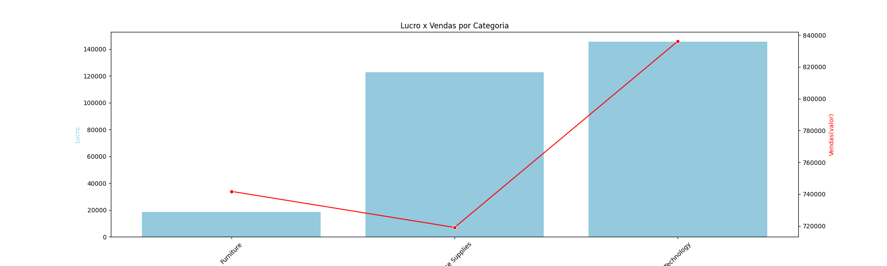

### 🔍 O que foi feito

Foi criado um gráfico de **dois eixos y (dual axis)** para comparar:

- **Lucro total (`Profit`)** por categoria (eixo y da esquerda — barras azuis)
- **Valor total de vendas (`Sales`)** por categoria (eixo y da direita — linha vermelha)

Essa abordagem permite **avaliar simultaneamente o volume de vendas e o resultado financeiro líquido** de cada categoria.

### 📈 Principais Insights

1. **Technology: alto desempenho em ambas as métricas**
   - Lidera em **lucro e vendas**, demonstrando ser a **categoria mais valiosa e lucrativa** da loja.

2. **Office Supplies: grande volume, rentabilidade moderada**
   - Possui **vendas robustas** (próximas a Technology), mas com lucro menor, sugerindo:
     - Menor margem por unidade
     - Produtos com preços baixos e giro alto

3. **Furniture: baixo lucro, vendas médias**
   - Tem um volume de vendas razoável, mas apresenta o **menor lucro**, o que pode indicar:
     - Altos custos logísticos
     - Margens estreitas
     - Problemas operacionais ou de precificação

### 🧠 Conclusões Gerais

- Este comparativo é fundamental para **entender o real impacto financeiro das categorias**, e não apenas o faturamento bruto.
- A análise evidencia que:
  - Nem sempre a **categoria mais vendida é a mais lucrativa**
  - **Gestão estratégica de margem** é tão importante quanto volume de vendas

## 📊 Ticket Médio por Categoria

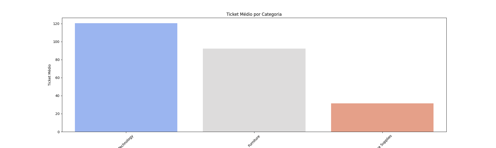

### 🔍 O que foi feito

Foi gerado um gráfico de barras que mostra o **ticket médio** de cada categoria, calculado pela fórmula:

- `Ticket Médio = Sales / Quantity`

Ou seja, representa o **valor médio por item vendido** em cada categoria (`Furniture`, `Office Supplies`, `Technology`).

### 📈 Principais Insights

1. **Technology: maior ticket médio**
   - Com média acima de **$120 por item**, a categoria **Technology** apresenta produtos de maior valor agregado, como notebooks, impressoras e dispositivos eletrônicos.

2. **Furniture: ticket médio intermediário**
   - A categoria **Furniture** tem ticket médio em torno de **$90**, refletindo itens volumosos e com preços médios mais altos, como cadeiras e mesas.

3. **Office Supplies: menor ticket médio**
   - Com cerca de **$32 por item**, Office Supplies inclui **produtos baratos e de consumo rotineiro**, como papelaria e utensílios de escritório.

### 🧠 Conclusões Gerais

- O ticket médio é um indicador essencial para definir **estratégias de precificação e abordagem comercial**.
- A categoria `Technology`, apesar de vender menos em quantidade, **compensa com valor unitário elevado**, o que explica seu alto faturamento e lucro.
- Já `Office Supplies`, embora com alto volume de vendas, **precisa de estratégias de escala ou aumento de margem** para se manter rentável.

---

# 🔹 Sub-Categoria

## 📊 Total de Vendas (valor) por Sub-Categoria

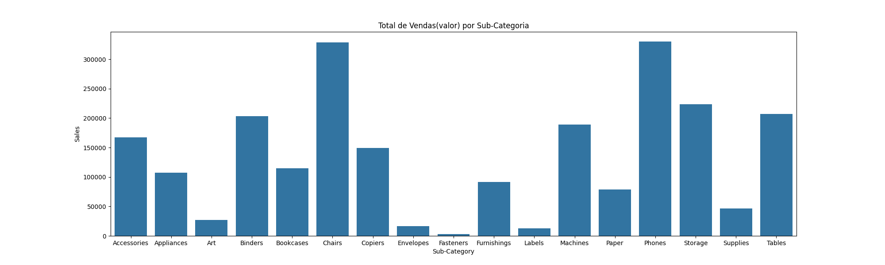

### 🔍 O que foi feito
Este gráfico de barras exibe o valor total de vendas acumulado (`Sales`) por subcategoria de produtos. Os dados foram agrupados pela coluna `Sub-Category` e somados para representar o desempenho financeiro de cada grupo de itens.

### 📈 Principais Insights

1. **Liderança de Phones e Chairs**
   - As subcategorias `Phones` e `Chairs` são as que mais geraram receita, ambas ultrapassando **300 mil dólares em vendas**.
   - Produtos tecnológicos e de escritório de maior valor unitário explicam esse resultado.

2. **Alto faturamento com baixo volume**
   - Subcategorias como `Copiers` e `Machines` apresentam **alta receita com menor quantidade vendida**, indicando **ticket médio elevado**.

3. **Desempenho modesto**
   - `Art`, `Fasteners` e `Labels` figuram entre as subcategorias com menor valor de vendas, refletindo **baixo volume e/ou ticket médio reduzido**.

### 🧠 Conclusões Gerais

- Subcategorias com alto valor de vendas devem ser priorizadas em **campanhas promocionais** e **gestão de estoque**.
- Itens com faturamento elevado, mas pouca saída (ex: `Copiers`, `Machines`), são candidatos ideais para **análises de margem e ticket médio**.
- Subcategorias com desempenho fraco devem ser avaliadas quanto à **rentabilidade real**, podendo indicar oportunidades para **reformulação do portfólio**.

  
 ## 📊 Quantidade Total por Sub-Categoria

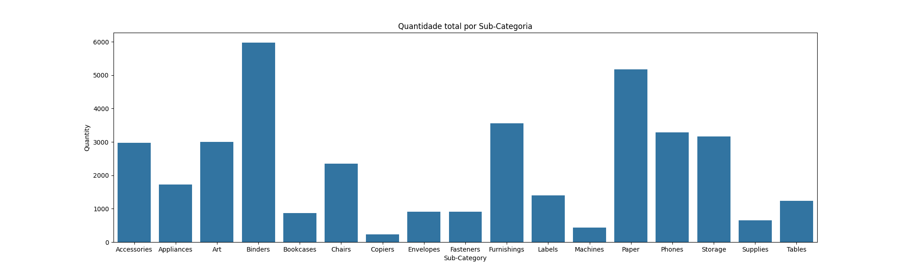

### 🔍 O que foi feito
Foi gerado um gráfico de barras que exibe a **quantidade total de itens vendidos** para cada subcategoria presente no dataset. Os dados foram agrupados por `Sub-Category` e somados pela coluna `Quantity`.

### 📈 Principais Insights

1. **Binders e Paper** dominam em volume de vendas
   - `Binders` lidera com quase **6.000 unidades vendidas**, seguido por `Paper`, com mais de **5.000 unidades**.
   - Estes são produtos de **consumo recorrente**, o que justifica seu alto volume.

2. **Subcategorias de nicho com menor volume**
   - `Copiers`, `Machines` e `Supplies` registram as menores quantidades, indicando menor rotatividade ou ticket elevado.

3. **Alta diversificação de vendas**
   - A dispersão das vendas entre subcategorias mostra um portfólio **bem distribuído**, cobrindo desde papelaria até tecnologia.

### 🧠 Conclusões Gerais

- O gráfico é útil para identificar **subcategorias estratégicas**, tanto para **reforço de estoque** quanto para **ações promocionais**.
- Subcategorias com alto volume, como `Binders`, merecem atenção especial em termos de **logística e margem unitária**.
- Já subcategorias com vendas menores devem ser avaliadas quanto à **rentabilidade e importância estratégica**, podendo ser nichos de alto valor.

## 📊 Lucro por Sub-Categoria

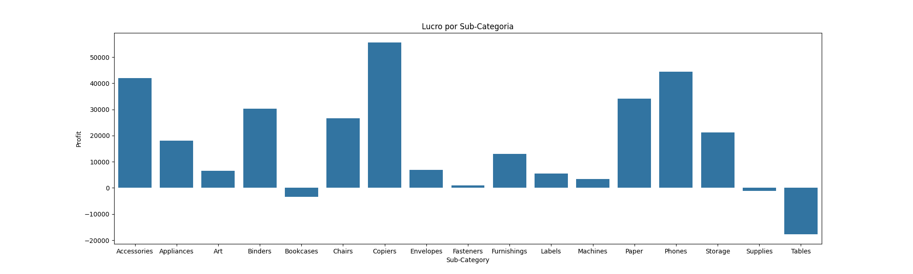

### 🔍 O que foi feito
Neste gráfico de barras, foram somados os valores da coluna `Profit` agrupados por `Sub-Category`. O objetivo é identificar quais subcategorias geram maior ou menor lucro total.

### 📈 Principais Insights

1. **Lucro expressivo em subcategorias específicas**
   - `Copiers`, `Phones`, `Accessories` e `Paper` são as subcategorias que mais se destacam em lucratividade.
   - Esses itens devem ser priorizados em estratégias de **crescimento e investimento**.

2. **Desempenho negativo**
   - Subcategorias como `Tables`, `Bookcases` e `Supplies` apresentam **lucro negativo**, indicando **prejuízo acumulado**.
   - Isso pode ser reflexo de preços baixos, altos custos ou excesso de descontos.

3. **Lucro modesto com alta receita**
   - `Chairs`, embora tenha alto volume de vendas, apresenta lucro moderado, o que pode sugerir uma **margem reduzida**.

### 🧠 Conclusões Gerais

- Subcategorias lucrativas devem ser mantidas como foco de **promoção e estoque**.
- Itens com prejuízo devem ser analisados para **revisão de custos**, precificação ou descontinuação.
- A comparação cruzada com o volume e ticket médio é essencial para ações assertivas.

## 📊 Lucro x Vendas (valor) por Sub-Categoria

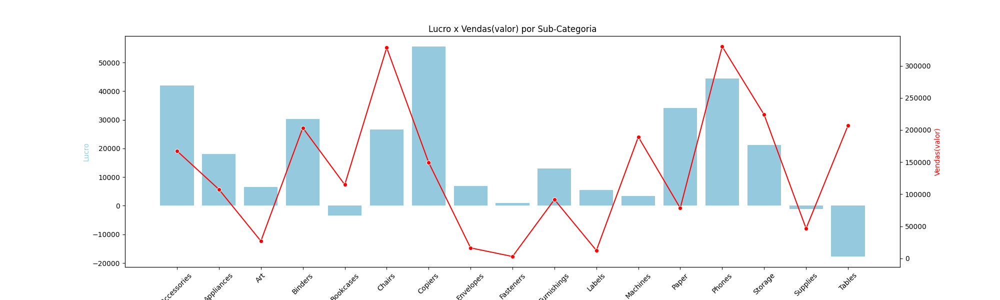

## 🔍 O que foi feito
Este gráfico de dois eixos combina:
- **Lucro (barras azuis)**: total da subcategoria.
- **Vendas (linha vermelha)**: valor total de vendas por subcategoria.

Foi utilizada a biblioteca `seaborn` com `barplot` e `lineplot` aplicados sobre eixos gêmeos (`twinx()`), permitindo observar simultaneamente as duas métricas.

### 📈 Principais Insights

1. **Alta venda, baixo lucro**
   - `Chairs` e `Tables` possuem grande volume de vendas, mas baixo ou até **negativo lucro**, o que pode indicar **custos elevados ou descontos agressivos**.

2. **Lucro elevado e vendas equilibradas**
   - `Copiers`, `Phones`, `Accessories` e `Paper` demonstram forte desempenho tanto em **valor vendido quanto em lucratividade**.
   - Subcategorias ideais para **investimentos e campanhas promocionais**.

3. **Desempenho fraco**
   - Subcategorias como `Bookcases`, `Fasteners`, `Supplies` e `Machines` possuem vendas e lucro baixos ou negativos. Avaliar **custo-benefício da manutenção no portfólio**.

### 🧠 Conclusões Gerais

- A comparação direta entre **valor gerado** e **lucro obtido** revela **eficiência comercial de cada subcategoria**.
- Estratégias como **ajuste de preços**, **redução de custos** ou **reposicionamento de produtos** podem ser definidas com base nestes resultados.

## 📊 Ticket Médio por Sub-Categoria

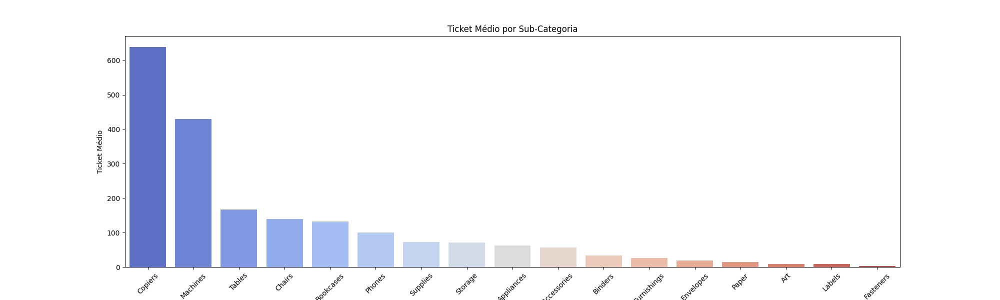

### 🔍 O que foi feito
Foi calculado o **ticket médio** para cada subcategoria, ou seja, a **média de valor gasto por item comprado**:
\[
\text{Ticket Médio} = \frac{\text{Total de Vendas}}{\text{Quantidade Vendida}}
\]
Os dados foram ordenados de forma decrescente e plotados com barras coloridas para facilitar a análise visual.

### 📈 Principais Insights

1. **Subcategorias de alto ticket médio**:
   - `Copiers` e `Machines` lideram com os **valores médios por venda mais altos**, indicando produtos **caros ou premium**.
   - Estratégias como **foco em upsell ou vendas consultivas** podem ser eficazes aqui.

2. **Ticket médio intermediário**:
   - `Tables`, `Chairs`, `Phones` e `Bookcases` apresentam valores razoáveis, com potencial para **combos promocionais** ou **kits de mobiliário**.

3. **Baixo ticket médio**:
   - Subcategorias como `Paper`, `Art`, `Labels` e `Fasteners` têm o menor valor por venda.
   - Essas são ideais para **ações de volume**, **freemium** ou **inclusão como brinde**.

### 🧠 Conclusões Gerais

- O ticket médio é um excelente indicador para **estratégia de precificação**, **posicionamento de produto** e **decisão de marketing**.
- Subcategorias com baixo ticket mas alto volume podem compensar em **receita total** — essas exigem estratégias de escala.
- Subcategorias com alto ticket médio devem ser **priorizadas em ações personalizadas e de maior valor agregado**.

---

# 🔹 Região

## 📊 Total de Vendas (valor) por Região

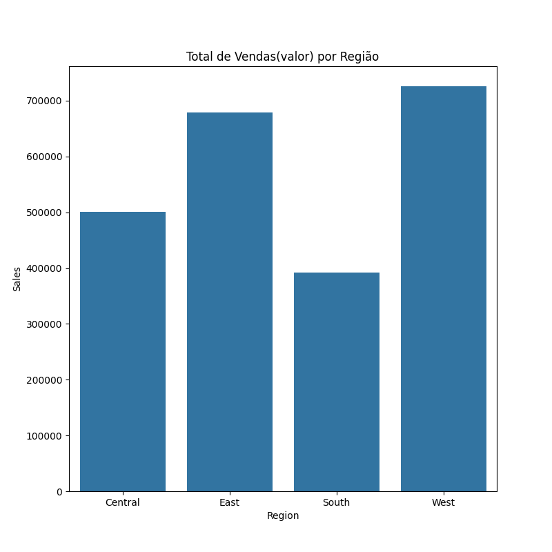

### 🔍 O que foi feito
Foram somadas todas as vendas realizadas em cada uma das quatro regiões do dataset (`Central`, `East`, `South` e `West`) para identificar onde está concentrada a maior receita.

### 📈 Principais Insights

- **Região Oeste (West)** lidera em vendas totais, ultrapassando **730 mil**, o que pode indicar uma base de clientes maior ou ticket médio mais alto.
- **Região Leste (East)** também se destaca com mais de **680 mil** em vendas.
- A **Região Sul (South)** apresentou o menor volume de vendas, sugerindo potencial para campanhas de crescimento ou maior penetração de mercado.
- **Região Central (Central)** encontra-se em posição intermediária, com mais de **500 mil** em vendas.

### 🧠 Conclusões Gerais

- A distribuição regional mostra **desigualdade nas receitas**, o que é útil para orientar estratégias de **expansão regional**, **alocação de equipe de vendas** ou **ações promocionais específicas**.
- A priorização de regiões pode ser feita com base nesse desempenho, e outras análises — como ticket médio e lucratividade — podem refinar ainda mais essas decisões.

## 📊 Quantidade de Vendas por Região

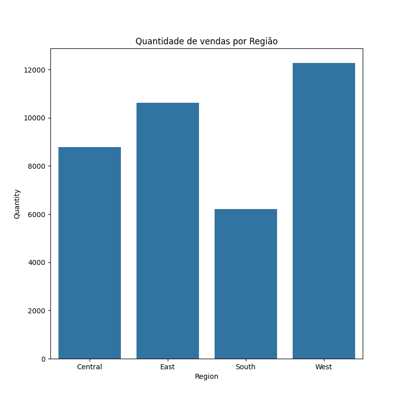

### 🔍 O que foi feito
Foi realizada a soma do número total de produtos vendidos (`Quantity`) por região no período analisado, destacando o volume operacional de cada área geográfica.

### 📈 Principais Insights

- A **Região Oeste (West)** se destaca com a **maior quantidade de produtos vendidos**, ultrapassando **12 mil unidades**, o que indica forte movimentação operacional.
- A **Região Leste (East)** também apresentou alto volume de vendas, seguida pela **Central (Central)**.
- A **Região Sul (South)** registrou a **menor quantidade de vendas**, com cerca de **6 mil unidades**, o que pode sinalizar menor demanda ou menor penetração de mercado.

### 🧠 Conclusões Gerais

- A **quantidade de vendas** complementa a análise de faturamento, ajudando a identificar **regiões com alta demanda** que podem se beneficiar de otimizações logísticas e estoques locais.
- Apesar do volume, é necessário cruzar esse dado com o **ticket médio** e **lucro por unidade** para entender a **eficiência comercial** de cada região.
- A **Região Sul**, com baixo volume, pode ser um ponto de atenção para **campanhas de marketing regionalizadas** ou **parcerias locais**.

## 📊 Lucro por Região

### 🔍 O que foi feito
Foi realizada a agregação do total de **lucros** (`Profit`) obtidos em cada **região geográfica**, com base em todas as transações registradas.

### 📈 Principais Insights

- A **Região Oeste (West)** gerou o **maior lucro total**, superando R$ 110 mil.
- A **Região Leste (East)** aparece logo em seguida, com mais de R$ 90 mil de lucro.
- As **Regiões Sul e Central**, apesar de registrarem vendas, apresentaram **menor rentabilidade** — o que pode indicar margens menores, descontos excessivos ou altos custos operacionais.

### 🧠 Conclusões Gerais

- O alto lucro da **Região Oeste** sugere **excelente performance comercial**, que pode estar associada a um **ticket médio mais alto** ou à venda de produtos com **maior margem**.
- Já as regiões com menor lucro devem ser investigadas: **quais produtos são mais vendidos**, **qual a margem aplicada**, **existem devoluções/fretes altos**?
- Essa análise reforça a importância de **combinar volume de vendas com indicadores financeiros**, como lucro e ticket médio, para decisões estratégicas.

## 📊 Lucro x Vendas (valor) por Região

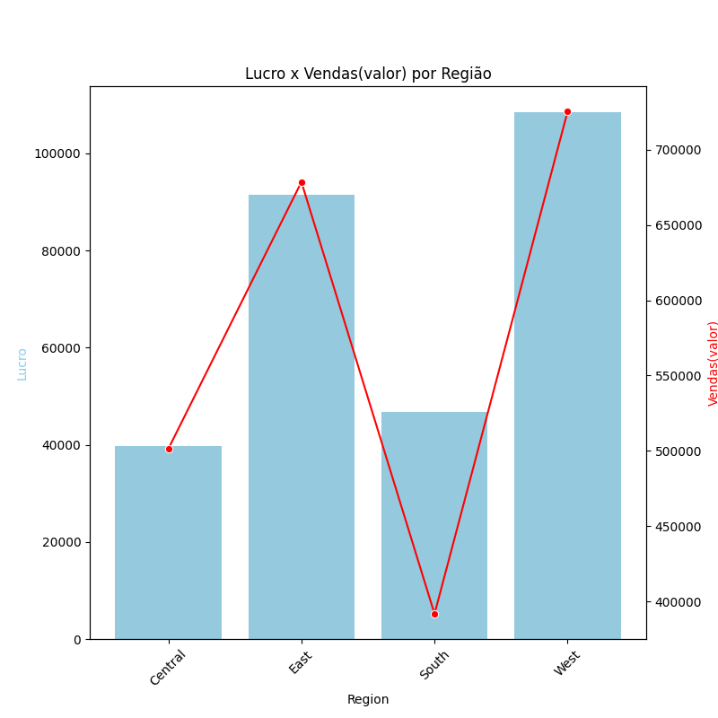

### 🔍 O que foi feito
Este gráfico compara **lucro total** (barras azuis) e **vendas totais (em valor)** (linha vermelha) para cada **região geográfica** da loja. Foi utilizado um gráfico de barras com dois eixos Y, para permitir a visualização conjunta dessas métricas financeiras.

### 📈 Principais Insights

- A **Região Oeste (West)** lidera tanto em **vendas** quanto em **lucro**, evidenciando um ótimo desempenho comercial.
- A **Região Leste (East)** também apresenta alta performance em ambas as métricas, embora com um pequeno gap em relação ao Oeste.
- A **Região Sul (South)** tem o **menor volume de vendas** e também o **menor lucro absoluto**, o que pode indicar baixa penetração ou produtos com margem reduzida.
- A **Região Central (Central)** tem vendas consideráveis, mas o lucro é proporcionalmente menor, indicando **menor margem de lucratividade**.

### 🧠 Conclusões Gerais

- Há **correlação positiva** entre volume de vendas e lucro nas regiões analisadas, porém **a eficiência em conversão de vendas em lucro varia significativamente**.
- Estratégias como **otimização do mix de produtos** e **ajuste de margem por região** podem ajudar a equilibrar os resultados.
- Recomenda-se também avaliar os **custos operacionais por região**, que podem influenciar diretamente na lucratividade observada.

## 📊 Ticket Médio por Região

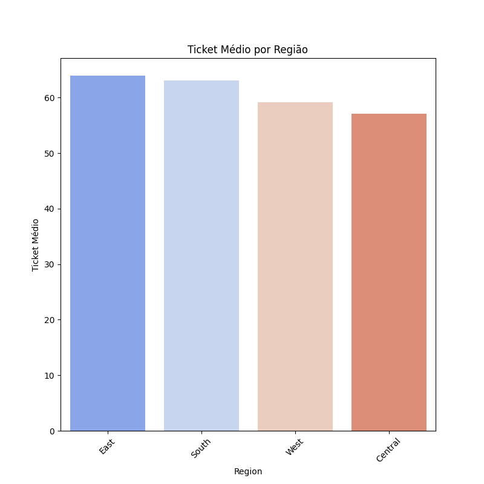

### 🔍 O que foi feito
Neste gráfico, foi calculado o **Ticket Médio** para cada região, ou seja, o valor médio gasto por pedido. O cálculo é feito pela fórmula:

**Ticket Médio = Total de Vendas / Quantidade de Produtos Vendidos**

Os dados foram ordenados de forma decrescente para facilitar a comparação entre as regiões.

### 📈 Principais Insights

- A **Região Leste (East)** apresentou o **maior ticket médio**, indicando que os clientes desta região, em média, realizam compras de maior valor.
- A **Região Sul (South)** também mostrou um ticket médio alto, apesar de ter o menor volume total de vendas — o que pode indicar um público mais seleto ou produtos mais caros.
- A **Região Central** teve o **menor ticket médio**, sinalizando compras de menor valor por transação. Isso pode justificar a menor lucratividade mesmo com um bom volume de vendas.

### 🧠 Conclusões Gerais

- O ticket médio é um **indicador-chave de eficiência de vendas** e pode revelar oportunidades para estratégias como **upselling e cross-selling**.
- Investir em campanhas específicas para aumentar o ticket médio da **Região Central** pode ajudar a melhorar os lucros, sem necessariamente aumentar o volume de pedidos.
- Também é importante observar se regiões com ticket médio mais elevado estão associadas a **custos maiores ou devoluções**, o que pode afetar a rentabilidade final.

---

# 🔹 Segmento

## 📊 Total de Vendas (valor) por Segmento

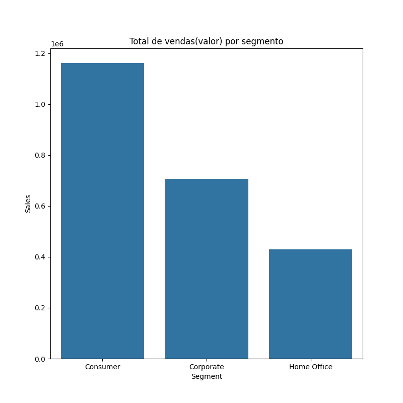

### 🔍 O que foi feito
Este gráfico de barras apresenta o **valor total de vendas** por segmento: `Consumer`, `Corporate` e `Home Office`.

Os dados foram agregados por meio da soma da variável `Sales`.

### 📈 Principais Insights

- O segmento **Consumer** lidera com folga em volume financeiro, superando 1 milhão em vendas.
- O segmento **Corporate** aparece em segundo lugar, com cerca de 70% do valor obtido em Consumer.
- O **Home Office**, apesar de relevante, representa a menor fatia do faturamento entre os três.

### 🧠 Conclusões Gerais

- O mercado **Consumer** é claramente o principal motor de receita da operação. Isso pode indicar:
  - Maior base de clientes finais,
  - Maior ticket médio ou volume de compras recorrentes.
- O segmento **Corporate**, embora menor, ainda representa uma parcela significativa da receita e pode oferecer **maior estabilidade e fidelização**.
- O **Home Office** tem desempenho inferior — ideal para ações de **crescimento, reengajamento ou reposicionamento estratégico**.

# 📊 Quantidade de Vendas por Segmento

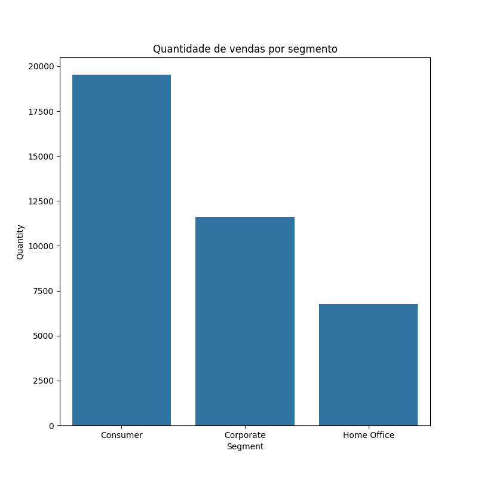

### 🔍 O que foi feito
Este gráfico de barras apresenta a **quantidade total de produtos vendidos** por segmento (`Consumer`, `Corporate`, `Home Office`) com base nos registros históricos de vendas.

A agregação foi feita por soma da variável `Quantity` utilizando `groupby`.

### 📈 Principais Insights

- O segmento **Consumer** é o mais representativo em volume, com quase o dobro da quantidade de vendas do segmento **Corporate**.
- **Home Office** apresenta o menor volume de vendas, o que pode impactar diretamente seu faturamento e lucratividade.

### 🧠 Conclusões Gerais

- A dominância do segmento Consumer em volume pode indicar uma **base de clientes mais ampla ou com maior frequência de compra**.
- O segmento **Corporate**, mesmo com volume menor, pode apresentar **melhor rentabilidade** dependendo da margem envolvida.
- É essencial investigar o segmento **Home Office**: há espaço para explorar estratégias de penetração, reposicionamento de produto ou campanhas específicas para este público.

## 📊 Lucro por Segmento

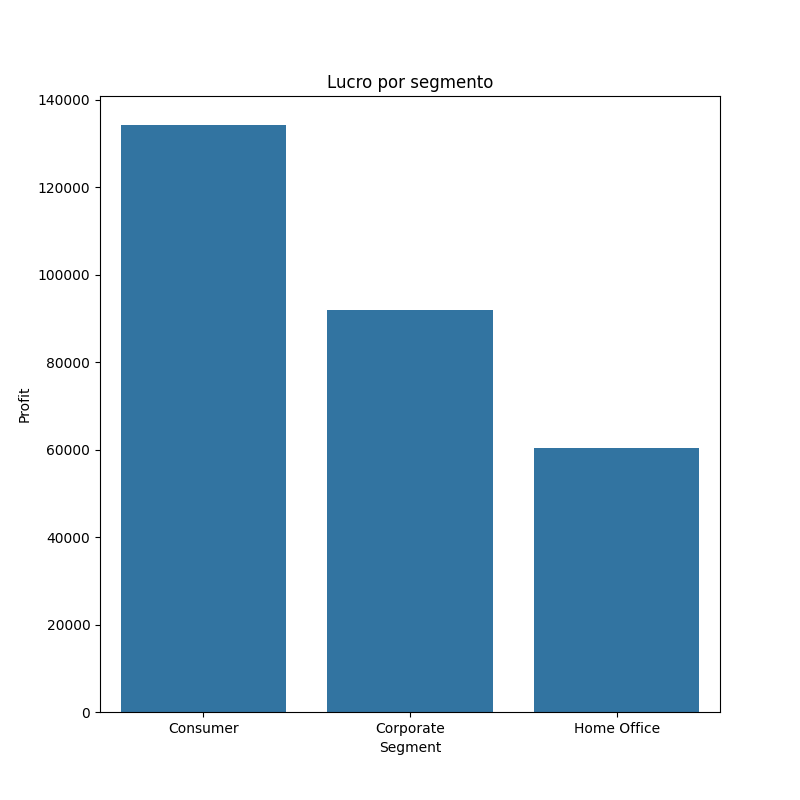

### 🔍 O que foi feito
O gráfico acima representa o **lucro total** obtido por cada segmento de clientes da empresa: `Consumer`, `Corporate` e `Home Office`.

A métrica de lucro foi agregada por segmento com a função `.sum()` e visualizada através de um gráfico de barras vertical.

### 📈 Principais Insights

- O segmento **Consumer** foi o mais lucrativo, apresentando um desempenho significativamente superior aos demais.
- O segmento **Corporate** gerou um lucro considerável, porém ainda abaixo do segmento Consumer.
- O segmento **Home Office** teve o menor lucro, o que pode indicar:
  - Menor volume de vendas,
  - Produtos com margens menores,
  - Ou altos custos associados.

### 🧠 Conclusões Gerais

- O foco em estratégias de fidelização e crescimento do segmento **Consumer** pode continuar gerando excelentes retornos.
- Há potencial para expansão no segmento **Corporate**, com políticas comerciais mais agressivas ou personalizadas.
- O segmento **Home Office** exige atenção: é necessário investigar se o baixo desempenho está relacionado a produtos, preços, canais de venda ou perfil de clientes.

## 📊 Lucro x Vendas (valor) por Segmento

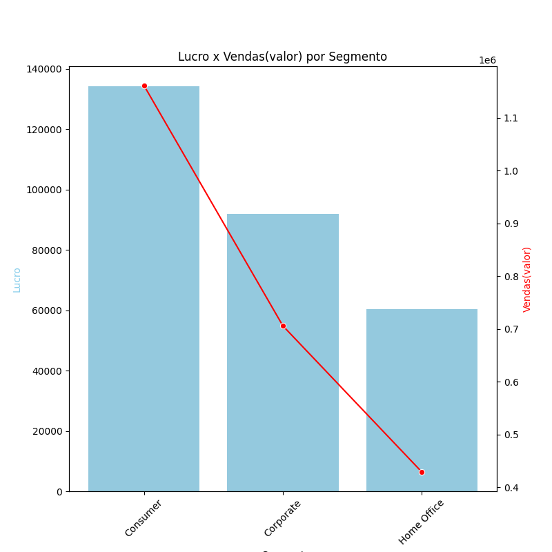

### 🔍 O que foi feito
Este gráfico combina dois eixos para analisar a relação entre:

- **Lucro total** (barra azul) e
- **Vendas totais em valor monetário** (linha vermelha com marcadores)

para cada um dos segmentos: `Consumer`, `Corporate` e `Home Office`.

### 📈 Principais Insights

- **Consumer** lidera tanto em vendas quanto em lucro absoluto, reforçando seu papel como **principal motor financeiro da operação**.
- O segmento **Corporate**, embora tenha vendas intermediárias, apresenta lucro **proporcionalmente menor**, sugerindo menor margem ou maior custo.
- **Home Office** é o segmento com o menor volume de vendas e o menor lucro, o que pode indicar baixo desempenho ou baixa penetração de mercado.

### 🧠 Conclusões Gerais

- A forte correlação entre vendas e lucro em Consumer indica um segmento **eficiente e rentável**, ideal para **investimentos em retenção e expansão**.
- A diferença entre vendas e lucro no segmento Corporate sugere necessidade de **otimização de margem ou renegociação de condições comerciais**.
- O Home Office pode ser explorado com campanhas de **crescimento, incentivo de vendas cruzadas ou foco em nichos específicos**.

## 📊 Ticket Médio por Segmento

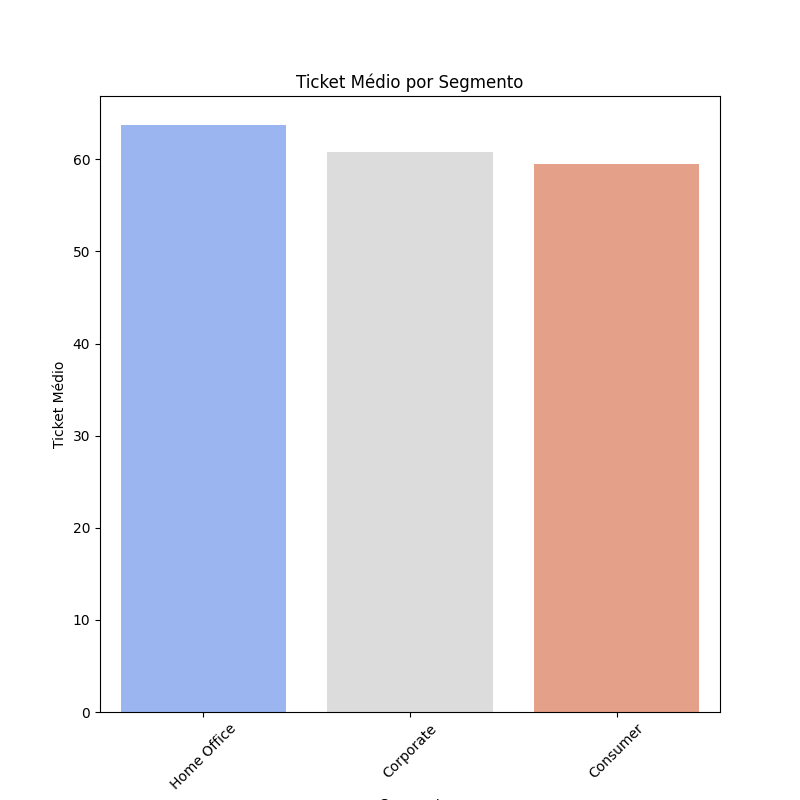

### 🔍 O que foi feito
Foi calculado o **ticket médio** por segmento, representando o valor médio por venda em cada segmento (`Sales / Quantity`). Os segmentos considerados foram:

- Consumer
- Corporate
- Home Office

### 📈 Principais Insights

- O segmento **Home Office** apresentou o maior ticket médio, mesmo sendo o de menor volume total de vendas.
- **Corporate** e **Consumer** têm tickets médios semelhantes, ligeiramente abaixo do Home Office, o que pode indicar uma abordagem mais **fragmentada ou de menor valor por venda**.
  
### 🧠 Conclusões Gerais

- O alto ticket médio do Home Office pode ser resultado de **vendas mais especializadas ou produtos de maior valor agregado**, apesar do volume reduzido.
- Para os segmentos Corporate e Consumer, estratégias de **aumento de ticket médio** (como upselling e bundles) podem trazer ganhos significativos sem aumentar o volume de vendas.
- Este tipo de análise auxilia na **definição de campanhas segmentadas**, promoções específicas e estratégias de precificação mais eficazes.

---

# 🔹 Cliente (Top 20)

## 📊 Top 20 Consumidores com Maior Vendas (valor)

### 🔍 O que foi feito
Foi realizada a soma total das vendas por cliente (campo `Customer Name`) e extraídos os **20 maiores consumidores** em termos de valor monetário total (`Sales`). O gráfico de barras apresenta esses clientes em ordem decrescente.

### 📈 Principais Insights

- **Sean Miller** lidera o ranking com um valor de vendas significativamente superior aos demais.
- Existe uma **diferença considerável** entre os dois primeiros colocados e o restante da lista, sugerindo concentração de receita.
- A curva após os cinco primeiros indica uma **queda progressiva**, mas ainda representa clientes valiosos.

### 🧠 Conclusões Gerais

- Clientes como **Sean Miller** e **Tamara Chand** devem ser considerados para **ações de retenção e fidelização**, já que representam uma parte substancial da receita.
- Estratégias de relacionamento personalizado com esse grupo pode gerar **aumento do ticket médio** e **redução de churn**.
- A análise reforça a importância da **segmentação de clientes baseada em valor**, contribuindo para decisões de marketing e atendimento estratégico.

## 📊 Top 20 Consumidores com Maior Lucro

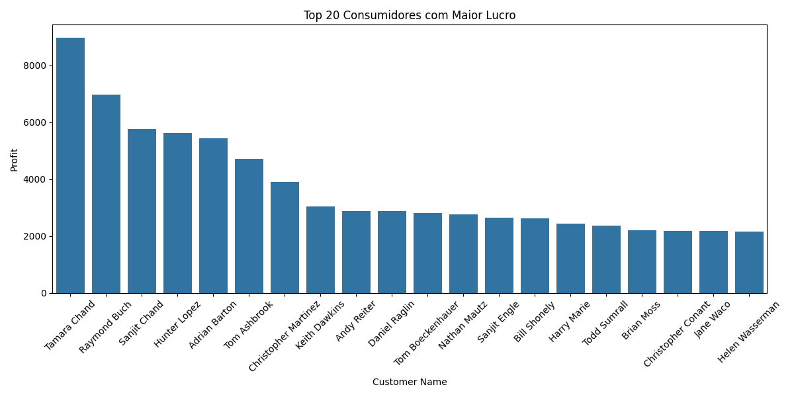

### 🔍 O que foi feito
Foi calculado o lucro total (`Profit`) por cliente (`Customer Name`) e os **20 consumidores mais lucrativos** foram selecionados e exibidos em ordem decrescente em um gráfico de barras.

### 📈 Principais Insights

- **Tamara Chand** lidera com grande margem de lucro, ultrapassando os demais consumidores de forma expressiva.
- Os cinco primeiros colocados representam uma **proporção significativa do lucro total gerado por clientes**.
- Alguns nomes aparecem também entre os maiores em valor de vendas, sugerindo **alta rentabilidade combinada com volume de transações**.

### 🧠 Conclusões Gerais

- É estratégico focar em **manter e expandir o relacionamento** com consumidores como Tamara Chand e Raymond Buch.
- Clientes com **baixo volume de vendas mas alta margem de lucro unitária** devem ser observados para **modelos de pricing diferenciados**.
- A análise pode servir como base para **estratégias de segmentação e personalização de campanhas** de retenção e expansão.

## 📊 Top 20 Consumidores com Maior Quantidade de Vendas

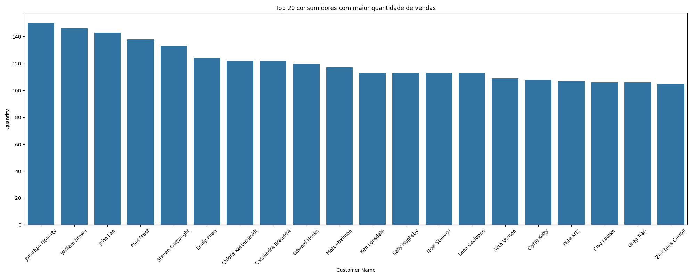

### 🔍 O que foi feito
Foi realizada a agregação da quantidade total de itens comprados (`Quantity`) por cliente (`Customer Name`) e os **20 consumidores mais ativos** em volume de compras foram destacados no gráfico.

### 📈 Principais Insights

- **Jonathan Doherty, William Brown e John Lee** lideram em volume de compras, sugerindo **frequência ou ticket unitário elevado**.
- Alguns consumidores apresentam **alta quantidade, mas não figuram entre os maiores em lucro ou valor de vendas**, o que pode indicar **baixo markup ou descontos frequentes**.
- Os consumidores no topo podem representar **casos de fidelização**, sendo importantes para manter o giro de estoque.

### 🧠 Conclusões Gerais

- Estratégias de **cross-sell e up-sell** devem ser direcionadas aos clientes com alto volume de compra, visando aumentar seu ticket médio.
- Avaliar a rentabilidade desses consumidores é essencial: **quantidade alta nem sempre se traduz em alto lucro**.
- Pode ser útil aplicar **segmentação RFM (Recência, Frequência e Valor Monetário)** para entender melhor o comportamento desses clientes.

---

# 🔹 Correlação entre variáveis

## 📊 Mapa de Calor das Correlações

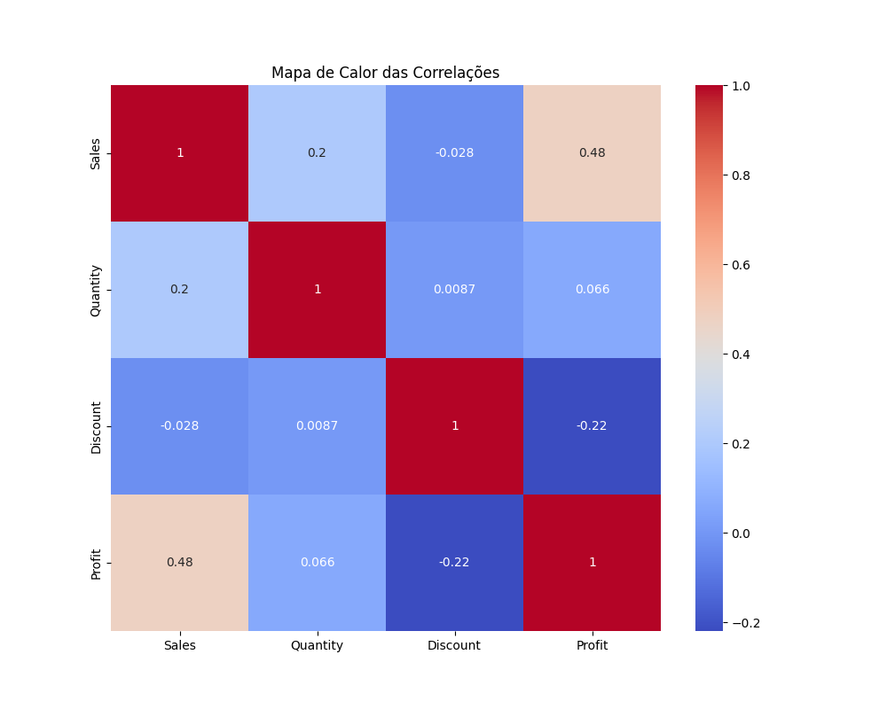

### 🔍 O que foi feito
Foi criado um **heatmap de correlação** entre as variáveis numéricas do dataset: `Sales`, `Quantity`, `Discount` e `Profit`. Esse tipo de visualização permite identificar relações lineares entre variáveis.

### 📈 Principais Insights

- A variável **`Profit` possui correlação moderada positiva com `Sales`** (`0.48`), o que é esperado, dado que lucros derivam das vendas.
- A variável **`Discount` tem correlação negativa com `Profit`** (`-0.22`), indicando que **maiores descontos tendem a reduzir os lucros**.
- **`Quantity` possui correlação fraca com todas as variáveis**, sugerindo que o volume de unidades vendidas **não é determinante direto nem do lucro nem do valor total da venda**.
- A correlação entre `Discount` e `Sales` é praticamente nula, **indicando que descontos não necessariamente aumentam as vendas**.

### 🧠 Conclusões Gerais

- **Descontos devem ser aplicados com cautela**, pois não aumentam substancialmente as vendas e impactam negativamente o lucro.
- Estratégias de **foco em aumento do ticket médio e mix de produtos com maior margem** podem ser mais eficazes que promoções agressivas.
- A **análise multivariada adicional** (como regressão ou clusterização) pode aprofundar essas relações e identificar perfis de clientes e produtos mais rentáveis.

---

# 📈 Resultados e Insights

## ✅ Categoria
- 📦 *Office Supplies* lidera em **quantidade de vendas**, mas não em lucro — **indicativo de produtos com baixo ticket ou margem**.
- 💻 *Technology* gerou o **maior lucro total**, com **o maior ticket médio**, demonstrando **alta rentabilidade**.
- 🛋️ *Furniture* possui **baixo lucro**, apesar de bom volume — pode haver **problemas de margem ou excesso de desconto**.

## ✅ Sub-Categoria
- 💺 *Chairs* e 📱 *Phones* se destacam com **altos valores de vendas e lucro**.
- ⚠️ *Tables* apresentou **prejuízo acumulado** — requer análise urgente.
- 🖨️ *Copiers* têm o **maior ticket médio**, mas volume baixo — ideal para estratégias focadas.
- Estratégias devem ser **segmentadas por subcategoria**, priorizando lucratividade.

## ✅ Região
- 🌎 *West* e *East* são líderes em **vendas e lucro** — mantê-las como **regiões estratégicas**.
- 🧭 *Central* apresenta **lucro inferior**, sendo uma **região com potencial de crescimento**.
- 📍 *South* tem o **maior ticket médio**, indicando **clientes de alto valor médio**.

## ✅ Segmento
- 👥 *Consumer* é o **segmento com maior volume de vendas e lucro absoluto**.
- 🏢 *Corporate* destaca-se pelo **ticket médio mais elevado** — foco em vendas de alto valor.
- 🏠 *Home Office* tem **desempenho mais fraco em todas as métricas** — sugerindo oportunidade para ações de incentivo ou realocação de esforços.

## ✅ Cliente
- 🏆 Os **20 principais clientes concentram a maior parte do lucro** — clientes estratégicos devem ser **retidos e priorizados**.
- ⚖️ Alto volume de compras **nem sempre gera alto lucro** — é crucial acompanhar **margem individual por cliente**.
- 👀 Clientes com muito volume mas pouco lucro podem estar concentrando **produtos de baixa margem ou exigindo muitos descontos**.

## ✅ Correlação
- 🔁 Correlação **moderada entre `Sales` e `Profit`** (`+0.48`), indicando que **nem toda venda gera lucro proporcional**.
- ❌ `Discount` tem correlação **negativa com `Profit`** (`-0.22`) — **descontos altos prejudicam a rentabilidade**.
- 📉 `Quantity` possui **correlação fraca com `Profit`**, sugerindo que **vender mais unidades não necessariamente é mais lucrativo**.

---
# 🧠 Conclusões e Recomendações

- 📊 **Volume de vendas não equivale a lucratividade** — é essencial acompanhar **margens e ticket médio** por categoria e cliente.
- 🛠️ **Revisar subcategorias com prejuízo ou baixa margem**, como *Tables*, para **ajuste de preços, renegociação com fornecedores ou descontinuidade**.
- 🌍 **Ajustar estratégias regionais** — investir mais nas regiões *West* e *East*, enquanto *Central* requer **ações corretivas ou campanhas locais**.
- 🧑‍💼 **Segmentar ações por perfil de cliente** — *Corporate* possui maior ticket médio, já *Consumer* traz volume, o que exige **abordagens distintas**.
- 🤝 **Focar na retenção dos clientes mais lucrativos** — priorizar relacionamento com o top 20, criando programas de fidelidade ou atendimento personalizado.
- 🔻 **Reavaliar políticas de desconto** — há **impacto negativo direto no lucro**, sendo necessário **estabelecer limites e utilizar descontos de forma estratégica**.

---

## Referências

- Dataset: [Superstore Dataset (Kaggle)](https://www.kaggle.com/datasets/vivek468/superstore-dataset-final)

---

## Sobre o Projeto

Este documento complementa o README principal, detalhando a análise exploratória e os insights estratégicos.

---

