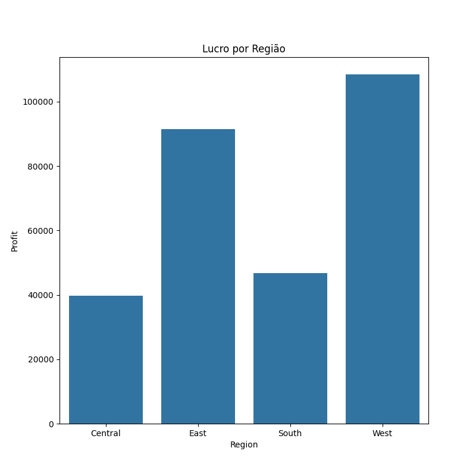

# 📊 Análise Detalhada - Superstore Sales Analysis

#### Este documento contém uma visão aprofundada das análises realizadas por dimensão no dataset Superstore.

## 🔹 Categoria
#### 🔸 Total de vendas, quantidade, lucro por categoria.

  
  
  

#### 🔸 Comparativo visual entre lucro x vendas por categoria.

#### 🔸 Cálculo do ticket médio por categoria.

## 🔹 Sub-Categoria
#### 🔸 Total de vendas, quantidade, lucro por sub-categoria.

  
  
  

#### 🔸 Comparativo visual entre lucro x vendas por sub-categoria.

#### 🔸 Cálculo do ticket médio por sub-categoria.

## 🔹 Região
#### 🔸 Total de vendas, quantidade, lucro por região.

  
  
  

#### 🔸 Comparativo visual entre lucro x vendas por região.

#### 🔸 Cálculo do ticket médio por região.

## 🔹 Segmento
#### 🔸 Total de vendas, quantidade, lucro por segmento.

  
  
  

#### 🔸 Comparativo visual entre lucro x vendas por segmento

#### 🔸 Cálculo do ticket médio por região.

## 🔹 Cliente (Top 20)

#### 🔸 Maior volume de vendas.

#### 🔸 Maior lucro gerado.

#### 🔸 Maior quantidade comprada.

## 🔹 Correlação entre variáveis
#### 🔸 Mapa de calor com correlação entre variáveis numéricas como Sales, Quantity, Discount, Profit.

## 📈 Resultados e Insights
### ✅ Categoria
Office Supplies teve a maior quantidade de vendas, mas não necessariamente o maior lucro.

Technology gerou o maior lucro total, mostrando que itens tecnológicos possuem maior margem.

Furniture teve vendas razoáveis, mas lucro mais baixo em comparação — possível foco de revisão de margem.

O ticket médio foi mais alto em Technology, evidenciando compras de maior valor unitário.

### ✅ Sub-Categoria
Subcategorias como Chairs e Phones se destacaram em vendas e lucro.

Algumas subcategorias, como Tables, apresentaram lucro negativo — possível prejuízo.

Copiers teve o maior ticket médio, sugerindo serem itens de alto valor.

Estratégias diferentes podem ser aplicadas a subcategorias com alto volume e baixo lucro.

### ✅ Região
West e East concentram maior volume de vendas.

A região Central teve menor lucro — oportunidade para melhorar performance ou ajustar estratégias.

O ticket médio foi maior no Sul (South), mesmo com menor volume de vendas.

### ✅ Segmento
Segmento Consumer é o que mais compra em volume.

Segmento Corporate apresenta maior ticket médio, o que pode indicar maior potencial de lucro por cliente.

Home Office tem desempenho mais fraco — pode ser explorado com campanhas específicas.

### ✅ Cliente
Top 20 clientes concentram parte significativa do lucro e vendas — potencial para estratégias de retenção e up-sell.

Clientes com grande volume nem sempre são os mais lucrativos — reforça a importância de analisar lucro por cliente.

### ✅ Correlação
Correlação positiva entre Sales e Profit, mas não muito forte.

Discount possui correlação negativa com Profit, sugerindo que grandes descontos prejudicam a rentabilidade.

Quantity tem correlação baixa com lucro, reforçando que volume nem sempre significa ganho.
