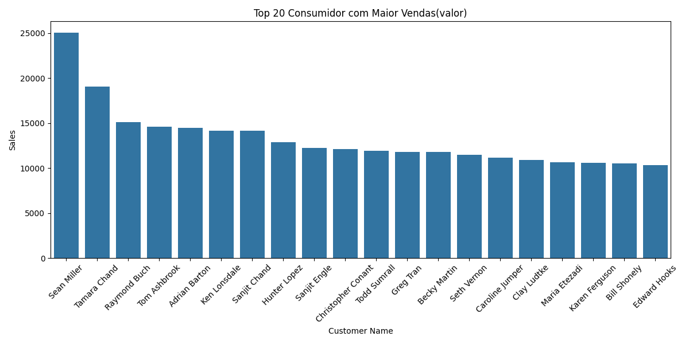

# 📊 Análise Detalhada - Superstore Sales Analysis

Este documento apresenta uma visão aprofundada das análises realizadas por dimensão no dataset Superstore.

---

## 📚 Sumário

- [🔹 Categoria](#categoria)
- [🔹 Sub-Categoria](#sub-categoria)
- [🔹 Região](#região)
- [🔹 Segmento](#segmento)
- [🔹 Cliente (Top 20)](#cliente-top-20)
- [🔹 Correlação entre variáveis](#correlação-entre-variáveis)
- [📈 Resultados e Insights](#resultados-e-insights)

---

# 🔹 Categoria

# 📊 Total de Vendas por Categoria

## 🔍 O que foi feito

Foi criado um gráfico de barras para apresentar o **total de vendas (em valor monetário)** de uma loja fictícia, segmentado por categoria de produtos. Os dados foram agrupados pela variável:

- `Category`: categoria do produto (`Furniture`, `Office Supplies`, `Technology`)
- `Sales`: valor monetário das vendas

A soma total por categoria foi calculada e visualizada com `seaborn.barplot()`.

## 📈 Principais Insights

1. **Categoria com maior faturamento: Technology**
   - A categoria **Technology** lidera as vendas, com um total superior a **$840.000**, indicando alto valor agregado por item ou forte volume de vendas.

2. **Furniture e Office Supplies em patamares similares**
   - Ambas as categorias apresentam vendas totais entre **$720.000 e $750.000**, com Furniture levemente à frente.
   - Isso sugere um **desempenho equilibrado** entre os segmentos, mas com potencial de crescimento em estratégias distintas.

3. **Tecnologia como motor de receita**
   - O domínio da categoria Technology pode indicar:
     - Alta demanda por eletrônicos e acessórios
     - Maiores margens por item
     - Campanhas promocionais eficazes nesse segmento

## 🧠 Conclusões Gerais

- A análise por categoria fornece **visão estratégica da composição da receita**, útil para ações de marketing, reposição de estoque e foco em atendimento especializado.
- Sugere-se acompanhar essa análise com:
  - **Lucro por categoria** (e não apenas vendas)
  - **Ticket médio**
  - **Frequência de compra por segmento**

Esse tipo de visualização é fundamental em **dashboards comerciais, relatórios de desempenho e apresentações executivas**.

# 📊 Quantidade Total de Produtos Vendidos por Categoria

## 🔍 O que foi feito

Foi criado um gráfico de barras exibindo o **volume total de unidades vendidas** por categoria de produto. As variáveis utilizadas foram:

- `Category`: categoria de produtos (`Furniture`, `Office Supplies`, `Technology`)
- `Quantity`: número total de unidades vendidas

Os dados foram agrupados por categoria e somados.

## 📈 Principais Insights

1. **Office Supplies lidera em quantidade**
   - A categoria **Office Supplies** ultrapassa 23.000 unidades vendidas, o que representa **o maior volume de vendas em quantidade**, embora não necessariamente em valor.

2. **Furniture e Technology com menor volume**
   - Ambas as categorias venderam significativamente menos em quantidade:
     - **Furniture:** cerca de 8.000 unidades
     - **Technology:** cerca de 7.000 unidades

3. **Venda em grande escala de itens de baixo valor**
   - O alto volume em `Office Supplies` indica que os produtos têm **alto giro**, mas provavelmente **baixo ticket médio** (papel, canetas, clipes, etc.).

4. **Tecnologia: menos itens, maior valor**
   - Em contraste, `Technology` vende menos unidades, mas sabemos (pelo gráfico anterior) que gera **maior valor em vendas**, confirmando seu **alto valor unitário**.

## 🧠 Conclusões Gerais

- A análise de quantidade por categoria é essencial para entender o **perfil operacional da loja**, especialmente para:
  - **Gestão de estoque**
  - **Logística**
  - **Planejamento de compras e reposições**
- Combinar essas informações com dados de lucro e margem ajuda a identificar **categorias estratégicas por valor e volume**.

# 📊 Lucro por Categoria

## 🔍 O que foi feito

Foi gerado um gráfico de barras exibindo o **lucro total obtido por categoria de produto**, com base nos dados históricos de vendas.

As variáveis analisadas foram:

- `Category`: categoria do produto (`Furniture`, `Office Supplies`, `Technology`)
- `Profit`: lucro gerado (vendas menos custo)

Os valores foram agregados via `groupby` e somados por categoria.

## 📈 Principais Insights

1. **Technology: maior lucratividade**
   - A categoria **Technology** apresentou o maior lucro absoluto, superior a **$145.000**, confirmando seu alto valor agregado e margem por unidade.

2. **Office Supplies: equilíbrio entre volume e margem**
   - Com cerca de **$123.000 de lucro**, Office Supplies demonstra ser uma **categoria rentável**, mesmo com preços unitários mais baixos, graças ao **alto volume de vendas**.

3. **Furniture: baixa margem de contribuição**
   - Apesar de ter vendas relevantes, Furniture obteve o menor lucro (cerca de **$19.000**), possivelmente devido a:
     - Altos custos logísticos
     - Descontos excessivos
     - Margem unitária reduzida

## 🧠 Conclusões Gerais

- O lucro por categoria é fundamental para avaliar a **eficiência comercial**, indo além do volume de vendas.
- A análise revela que **vender muito nem sempre significa lucrar mais** — o foco deve estar em categorias com **boa margem e volume estratégico**.
- Recomendação: aprofundar a análise de Furniture para entender os gargalos (ex: frete, devoluções, descontos, fornecedores).

# 📊 Comparativo de Lucro x Vendas por Categoria

## 🔍 O que foi feito

Foi criado um gráfico de **dois eixos y (dual axis)** para comparar:

- **Lucro total (`Profit`)** por categoria (eixo y da esquerda — barras azuis)
- **Valor total de vendas (`Sales`)** por categoria (eixo y da direita — linha vermelha)

Essa abordagem permite **avaliar simultaneamente o volume de vendas e o resultado financeiro líquido** de cada categoria.

## 📈 Principais Insights

1. **Technology: alto desempenho em ambas as métricas**
   - Lidera em **lucro e vendas**, demonstrando ser a **categoria mais valiosa e lucrativa** da loja.

2. **Office Supplies: grande volume, rentabilidade moderada**
   - Possui **vendas robustas** (próximas a Technology), mas com lucro menor, sugerindo:
     - Menor margem por unidade
     - Produtos com preços baixos e giro alto

3. **Furniture: baixo lucro, vendas médias**
   - Tem um volume de vendas razoável, mas apresenta o **menor lucro**, o que pode indicar:
     - Altos custos logísticos
     - Margens estreitas
     - Problemas operacionais ou de precificação

## 🧠 Conclusões Gerais

- Este comparativo é fundamental para **entender o real impacto financeiro das categorias**, e não apenas o faturamento bruto.
- A análise evidencia que:
  - Nem sempre a **categoria mais vendida é a mais lucrativa**
  - **Gestão estratégica de margem** é tão importante quanto volume de vendas

# 💳 Ticket Médio por Categoria

## 🔍 O que foi feito

Foi gerado um gráfico de barras que mostra o **ticket médio** de cada categoria, calculado pela fórmula:

- `Ticket Médio = Sales / Quantity`

Ou seja, representa o **valor médio por item vendido** em cada categoria (`Furniture`, `Office Supplies`, `Technology`).

## 📈 Principais Insights

1. **Technology: maior ticket médio**
   - Com média acima de **$120 por item**, a categoria **Technology** apresenta produtos de maior valor agregado, como notebooks, impressoras e dispositivos eletrônicos.

2. **Furniture: ticket médio intermediário**
   - A categoria **Furniture** tem ticket médio em torno de **$90**, refletindo itens volumosos e com preços médios mais altos, como cadeiras e mesas.

3. **Office Supplies: menor ticket médio**
   - Com cerca de **$32 por item**, Office Supplies inclui **produtos baratos e de consumo rotineiro**, como papelaria e utensílios de escritório.

## 🧠 Conclusões Gerais

- O ticket médio é um indicador essencial para definir **estratégias de precificação e abordagem comercial**.
- A categoria `Technology`, apesar de vender menos em quantidade, **compensa com valor unitário elevado**, o que explica seu alto faturamento e lucro.
- Já `Office Supplies`, embora com alto volume de vendas, **precisa de estratégias de escala ou aumento de margem** para se manter rentável.

---

# 🔹 Sub-Categoria

### 🔸 Total de vendas, quantidade, lucro por sub-categoria

  
  
  

### 🔸 Comparativo lucro x vendas por sub-categoria

### 🔸 Ticket médio por sub-categoria

---

## 🔹 Região

### 🔸 Total de vendas, quantidade, lucro por região

  
  
  

### 🔸 Comparativo lucro x vendas por região

### 🔸 Ticket médio por região

---

## 🔹 Segmento

### 🔸 Total de vendas, quantidade, lucro por segmento

  
  
  

### 🔸 Comparativo lucro x vendas por segmento

### 🔸 Ticket médio por segmento

---

## 🔹 Cliente (Top 20)

### 🔸 Maior volume de vendas

### 🔸 Maior lucro gerado

### 🔸 Maior quantidade comprada

---

## 🔹 Correlação entre variáveis

### 🔸 Mapa de calor entre Sales, Quantity, Discount, Profit

---

## 📈 Resultados e Insights

### ✅ Categoria
- *Office Supplies* teve o maior volume de vendas, mas não o maior lucro.
- *Technology* gerou o maior lucro total, indicando alta margem.
- *Furniture* apresenta lucro mais baixo — possível revisão de estratégias.
- Maior ticket médio em *Technology*.

### ✅ Sub-Categoria
- *Chairs* e *Phones* lideram em vendas e lucro.
- *Tables* com prejuízo — alerta de possível problema.
- *Copiers* tem maior ticket médio.
- Estratégias devem variar por subcategoria.

### ✅ Região
- *West* e *East* dominam em vendas.
- *Central* tem lucro fraco — oportunidade de melhoria.
- Maior ticket médio na região *South*.

### ✅ Segmento
- *Consumer* lidera em volume.
- *Corporate* apresenta maior ticket médio.
- *Home Office* tem desempenho inferior — foco potencial para campanhas.

### ✅ Cliente
- Top 20 concentram a maior parte do lucro.
- Volume ≠ Lucro → atenção ao desempenho individual de clientes.

### ✅ Correlação
- Correlação fraca entre Sales e Profit.
- *Discount* afeta negativamente o lucro.
- Volume (Quantity) tem pouco impacto no lucro.

---
## Conclusões e Recomendações

- Volume de vendas não garante lucro.
- Revisar subcategorias deficitárias para melhoria de margem.
- Ajustar estratégias por região e segmento.
- Focar em retenção dos clientes mais lucrativos.
- Reduzir descontos abusivos para proteger rentabilidade.

---

## Referências

- Dataset: [Superstore Dataset (Kaggle)](https://www.kaggle.com/datasets/vivek468/superstore-dataset-final)

---

## Sobre o Projeto

Este documento complementa o README principal, detalhando a análise exploratória e os insights estratégicos.

---

